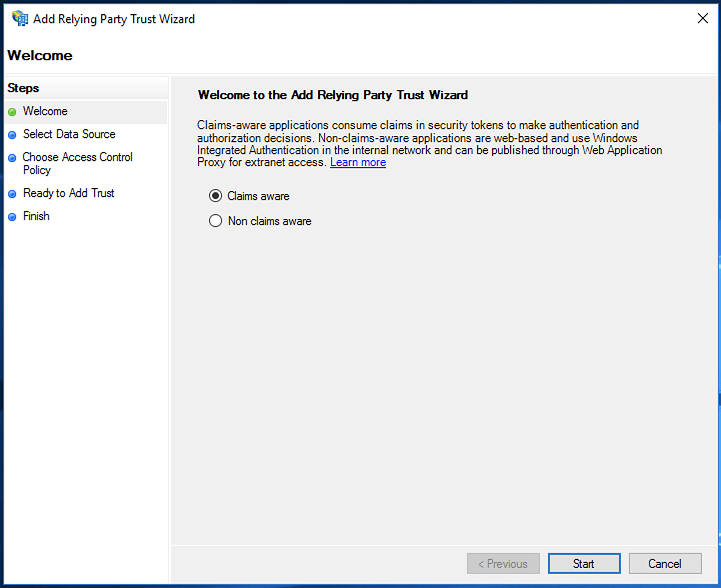
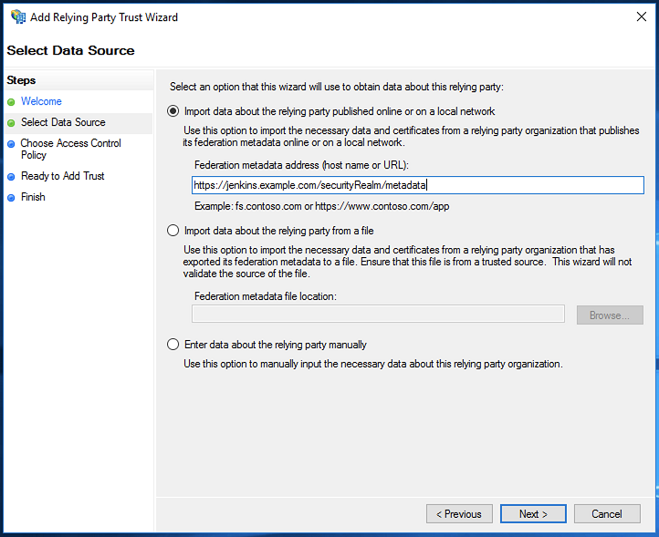
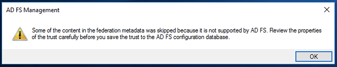
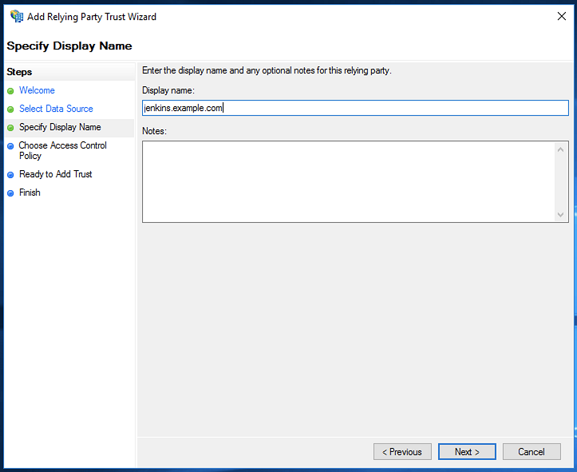
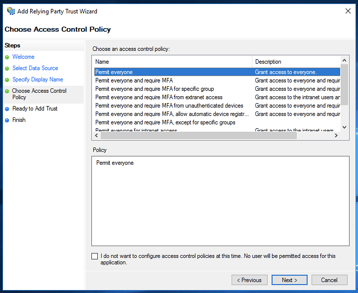
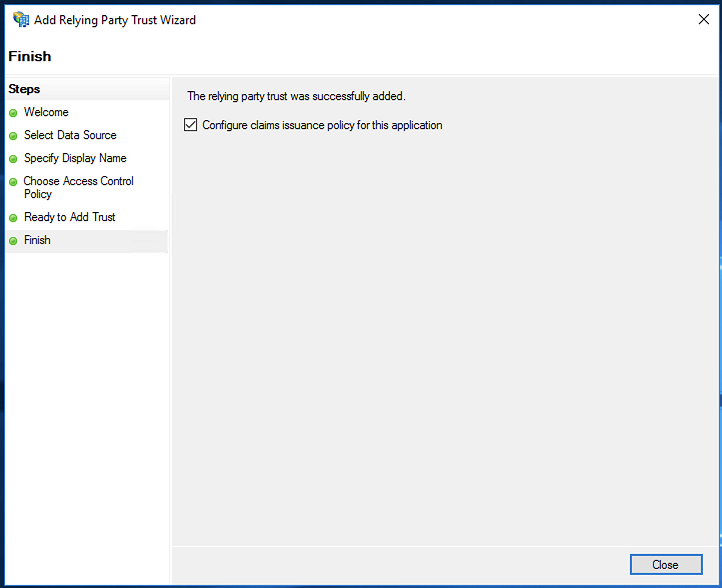
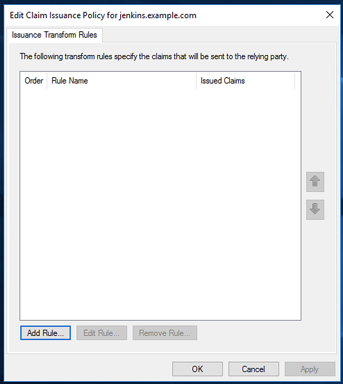
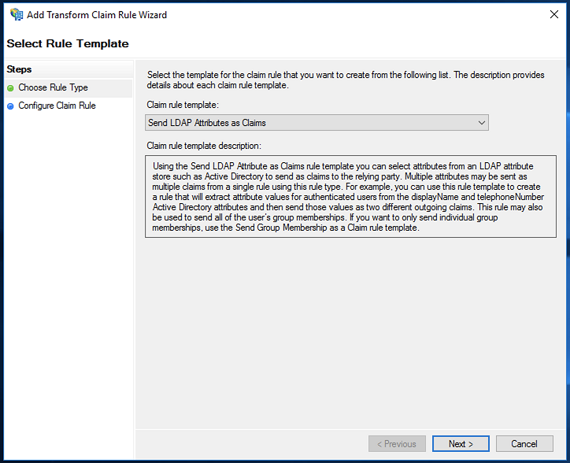
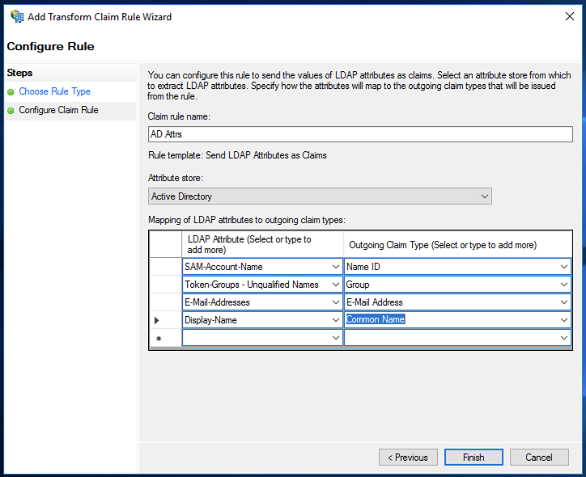

Example: Setting up Active Directory Federation Services (ADFS) to use with Jenkins
----------------

*Note:* replace adfs.example.com with the name of your ADFS, replace jenkins.example.com with the name of your Jenkins host.

**On the Jenkins side:**

* Set the `IdP Metadata URL` to `https://adfs.example.com/FederationMetadata/2007-06/FederationMetadata.xml`
* Set the `Refresh Period` to `1440` (24h, suggested value)

This allows the SAML plugin to fetch the IdP file from ADFS and should avoid needing to update it when certs/keys change.

If loading the xml manually, it may be necessary to set the system property `-Dorg.apache.xml.security.ignoreLineBreaks=true`
when starting Jenkins. This does not appear to be necessary when allowing the plugin to fetch the XML directly.

It is recommended to configure the following attributes, depending on your IdP configuration and preferences the values may be different.
| Attribute | Value |
|--|--|
| Display Name | http://schemas.xmlsoap.org/claims/CommonName |
| Group | http://schemas.xmlsoap.org/claims/Group |
| Email | http://schemas.xmlsoap.org/ws/2005/05/identity/claims/emailaddress |

Username is not set as it is using the `Name Id` field.

**On the Windows side:**

Open the Management console (mmc), make sure you have the AD FS Management snap-in. Add a Relying Party Trust:

Using the wizard and the SP metadata URL will make this process very straight forward.  The screenshots below are from
the wizard with the verify step omitted. Depending on the ADFS version in use, you may receive the warning shown in the
screenshot. Even if you don't receive the warning it is still a good idea to review all of the parameters. At this time,
there are no known issues with ADFS being able to import and utilize the metadata.

In the `Choose Access Control Policy` step, choose the appropriate policy to meet your requirements. The
`Permit Everyone` policy was chosen here more for demonstration purposes.

 

 

 

The second step is to configure the claims. This should be launched automatically by the last step of the wizard. If it
is not, select the entry in the `Relying Part Trusts` and either right click and select `Edit Claim Issuance Policy...`
or click `Edit Claim Issuance Policy...` on the right. These may need to be adjusted based on your environment. The
following are used for demonstration purposes and align with the attributes set in Jenkins. Of note is the group
attribute, the use of `unqualified names` will likely make using this attribute for authorization easier.

 

